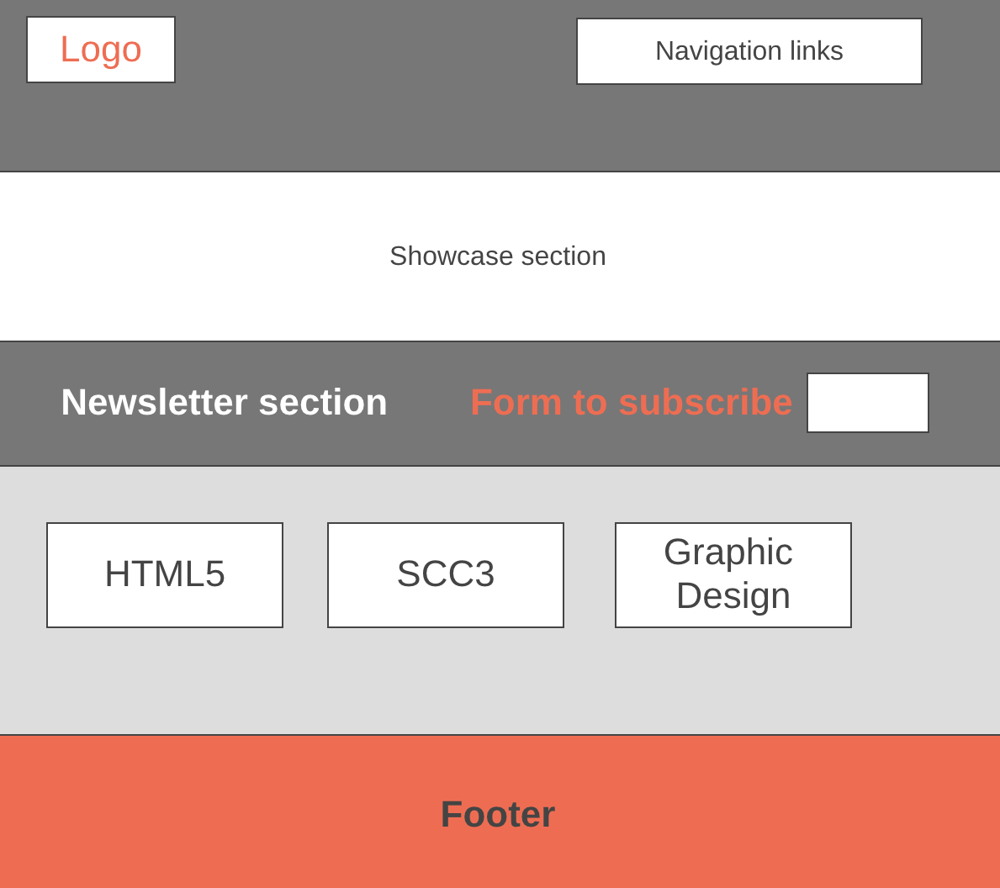

# Development Strategy

> `Acme Web Design`

write a short description of your project:
- who would want to use it?
- why would they want to use it?

## Wireframe

<!-- include a wireframe for your project in this repository, and display it here -->
<!-- wireframe.cc is a good site for getting started with wireframes -->

## 0. Set-Up

__A User can see my initial repository and live demo__

### Repo

- Generate from Template
- Write initial, basic README
- Turn on GitHub Pages

## 1. User Story: HTML structure

### Branches

1. This user story was developed on a brach called `home-page-structure`
2. It was merged to `master` when the feature was finished.

### HTML

- A header element with a title describing the web page
- A nav element with set of navigation links
- A section elements with main text
- A section element with form for subscriptions 
- A section with images for HTML CSS and JS
- A footer element

### CSS

There is no any css styling so far 

## 2. User Story: Header and navigation menu

### Branches

1. This user story was developed on a brach called `header`
2. It was merged to `master` when the feature was finished.

### CSS
 - General styling the body of the webpage 
 - Styling the branding `Acme Web Design`
 - Styling the navigation links: `Home`, `About`, `Services`

## 3. User Story: Showcase section

### Branches

1. This user story was developed on a brach called `showcase`
2. It was merged to `master` when the feature was finished.

### CSS
 
 - Styling the  `showcase` section
 - Applying the background picture

## 4. User Story: Newsletter section

### Branches

1. This user story was developed on a brach called `newsletter`
2. It was merged to `master` when the feature was finished.

### CSS
 
 - Styling the  `newsletter` section
 - Styling `form`, `button`, `input`

## 5. User Story: Boxes section

### Branches

1. This user story was developed on a brach called `boxes`
2. It was merged to `master` when the feature was finished.

### CSS
 
 - Styling the  `boxes` section 

## 5. User Story: Footer

### Branches

1. This user story was developed on a brach called `footer`
2. It was merged to `master` when the feature was finished.

### CSS
 
 - Styling the  `footer` 

## 6. User Story: ABOUT HTML structure

### Branches

1. This user story was developed on a brach called `about_structure`
2. It was merged to `master` when the feature was finished.

### HTML

- A section element with main text `About us`
- An aside element with text `What We Do`

### CSS

There is no additional css styling for About page so far

## 7. User Story: ABOUT styling

### Branches

1. This user story was developed on a brach called `about_article_aside`
2. It was merged to `master` when the feature was finished.

## HTML

- Applying the dark class for `aside` and `paragraph`

### CSS

- Styling the  `article id="main-col"`  
- Styling the aside element

## 8. User Story: SERVICES structure

### Branches

1. This user story was developed on a brach called `services_structure`
2. It was merged to `master` when the feature was finished.

### HTML

- A section element with main text `About us`
- An aside element with text `What We Do`

### CSS

- Styling the `services`

## 9. User Story: Media Queries

### Branches

1. This user story was developed on a brach called `media_queries`
2. It was merged to `master` when the feature was finished.

### CSS

- Apply media queries for  displays `max-width : 768px`

